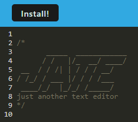

# pwa-text-editor

## Description

Challenge 19 -- Progressive Web Applications (PWA): Text Editor

This project was built so that a user can easily access a text editor, either inside the website, or by installing it as its own application on your desktop. The app is a single-page application that meets PWA criteria and features several data persistence techniques that allows functionality also offline through the installed application. This project was built with the IDB (IndexedDB) package, and was completed off the starter code, given by the assignment. 

When you first enter the site, you're able to see the text editor, usable online through the site as is. However, you can also click the 'Install' button in the top left corner and install the app onto your computer for later, or offline, use. Type to your heart's content!

## Table of Contents

- [Installation](#installation)
- [Usage](#usage)
- [License](#license)
- [Badges](#badges)
- [Features](#features)
- [Tests](#tests)
- [Questions](#questions)

## Installation

- For application-specific use, please see the [Description](#description) section.

- For coding purposes: 

    * Please have installed Node JS before attempting to run the program (I have v20.10.0)

    * Please also install the dependencies inside the code shown in the package.json -- For ease of installation, I have implemented a script, so simply in your terminal just type `npm run install` and it will install the main dependencies and the other package.json's within the app. 

    * (The list of required dependencies for manual installation is: express.js, webpack, webpack-dev-server, webpack-pwa-manifest, babel, css-loader, concurrently, and idb.)

## Usage

To visit the deployed application, use the following link:
https://text-editor-4xfd.onrender.com
- Please revisit the [Description](#description) section to review application specific features.

Screenshot of deployed application:

## License

[MIT License](https://opensource.org/licenses/MIT)

## Badges

## Features

- JavaScript
- Webpack
- IndexedDB
- Babel
- Service Worker
- Node JS
- Express
- Nodemon
- CSS
- HTML5
- Deployed with Render

## Tests

If any testing of the code is being done, please take note of the several scripts available listed in the main package.json for ease of use.

## Questions

If you have any questions, feel free to reach out to me via [GitHub](https://github.com/jskelly8/) or email me at jessskelton888@gmail.com.
